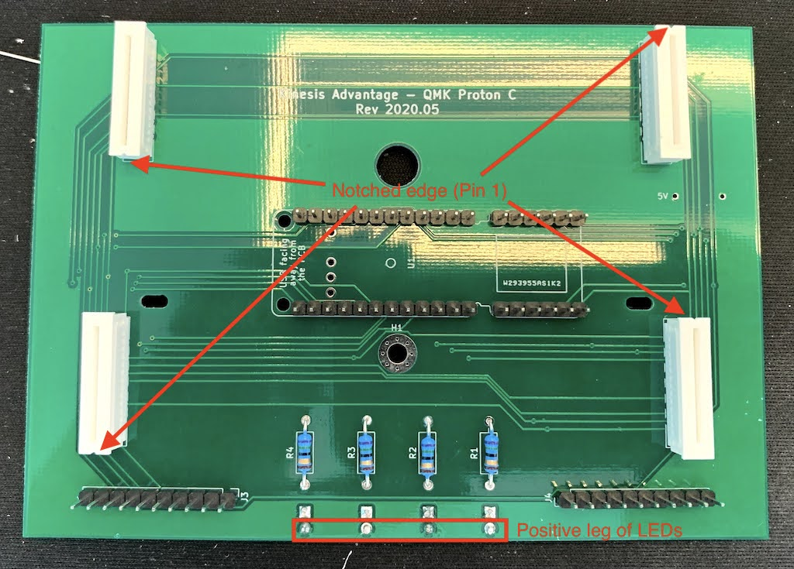

# QMK-compatible replacement board for Kinesis Advantage

This replacement board allows you to use QMK on the [Kinesis Advantage
(KB500USB)](https://kinesis-ergo.com/support/advantage/).

This is the original version of the Kinesis Advantage and it lacks
much of the nice programmability and advanced features of the newer
[Advantage 2](https://kinesis-ergo.com/support/advantage2/) keyboards.

The replacement controller board here uses a [QMK Proton
C](https://qmk.fm/proton-c/). The replacement maintains the use of all
keys, all LEDs, and even the speaker for audio. You will also get to
replace the USB connector for a USB-C one. The only downside is that
the USB ports and optional foot pedals will not work here.

## Technical details

You can find details I reverse engineered in:

* [PCB Mechanicals](mechanical.md)
* [Wiring matrix](matrix.md)

## Assembly

### PCB Fabrication

The fabrication-ready files are in `plots/`. Just send them to your
preferred fab. It is a pretty standard 1.6mm PCB with conservative via
and track parameters that just about any shop can handle.

### Components

* 1x [QMK Proton C](https://qmk.fm/proton-c/)
* 4x [1.25mm Pitch Easy-On FFC/FPC
    Connectors](https://www.molex.com/molex/products/part-detail/ffc_fpc_connectors/0039532135)
* 4x 3mm T-1 LEDs (see LED chart)
* 4x axial through-hole resistors, 1/4W, 1% (see LED chart)
* 2.54mm "board-to-board" pin headers
  * 2x 12 pins
  * 2x 6 pins
  * 4x 10 pins
* 2x 2.54mm 8-pin IDC-IDC ribbon cables, 100mm length minimum
* 1x USB-C cable, 1M length minimum
* (Optional) 1x AST1109MLTRQ piezo speaker

#### LEDs

I used blue LEDs in my build for a distinctive appearance. You could
use other colors or even mix and match colors. You will have to use
different resistors for each type of LED.

The LEDs are powered from Vusb @ 5V, and the Proton C's pins operate
at 3.3V and can sink a decent amount of current, allowing for a fairly
wide selection of LEDs.

The following table is a guideline for some common LED values to
operate a maximum brightness. You should check your LED datasheet to
confirm.

| LED color      | LED voltage | LED current | Resistor |
|----------------|-------------|-------------|----------|
| Blue (472nm)   | 3.5V        | 20mA        | 75ohms   |
| Red (640nm)    | 1.8V        | 20mA        | 160ohms  |
| Yellow (590nm) | 2.0V        | 20mA        | 150ohms  |

### Steps

1. Disassemble keyboard
2. Replace existing ribbon cables
3. Assemble PCB
4. Re-assemble keyboard
5. Flash firmware and test

#### Disassemble keyboard

To Kinesis's credit, their keyboards are very easy to disassemble and
clean. There are six screws to remove from the bottom of the keyboard
to open it.

The USB cable is connected to a daughter board with the USB
ports. Separate the connector from the daughter board and remove the
retaining ring around the strain relief. This will allows you to
remove the USB cable completely. We will be running the new USB-C
cable through this hole. The daughter board will remain glued to the
bottom shell.

There is another cable that connects the daughter board to the main
controller board. I find it easier to remove the connector at the end
attached to the daughter board.

At this point, you can separate the bottom and top halves of the
keyboard.

You can detach the four flex cables from the main board. There is a
single retaining screw holding the main board down. Remove
this. Finally, remove the four screws on each thumb cluster. There is
a clamp on one of these screws holding the daughter board cable. Keep
this clamp as we will be reusing it later. You can now take out the
thumb cluster boards and the main board.

#### Replace ribbon cables

Unfortunately, the cables connecting the thumb clusters to the main
board are soldered. Instead of just reconnecting this to our new
board, we will replace them with pin headers and detachable cables.

It's easiest now to just cut the cables in half and desolder them from
each of the thumb clusters. Install the pin headers. They should be
facing the side opposite the key switches. I made the mistake of
soldering them on the wrong side, necessitating another tedious
desoldering.

#### Assemble PCB

I find it easiest to assemble the board in the following order:

1. Resistors
2. FPC connectors
3. Pin headers
4. LEDs
5. Proton C

Note the orientation of the FPC connectors. There is a notch on the
short edge closest to Pin 1 and this should correspond to the small
triangle on the footprint, or the square pad.

We are only installing header pins for the external rows of the Proton
C. You can ignore the internal pins. Do also solder the pin headers
for the thumb clusters.

The LEDs are installed on the reverse side of the PCB. Take care with
their alignment as they fit loosely on the PCB but have tighter
tolerances when installed into the plastic upper shell. As always,
orientation matters for diodes and Pin 1 (square pad) is for the
negative (shorter) leg.

The Proton C is the last component to be soldered. It should be
installed with the USB port facing away from the PCB and towards
you. If you want to use the optional speaker, solder it to the Proton
C before installing the Proton C to the main board.

#### Re-assemble keyboard

We are only using eight of the ten pins for each thumb cluster. Make
sure you connect pins 1-8 (Pin 1 has the square pad), leaving out pins
9-10 on both the thumb cluster and main board.

Don't forget to reinstall the clamp when attaching the screws for the
thumb clusters.

Finally, the USB C cable is plugged in to the Proton C. You will want
to loop it through the clamp to relieve strain on the Proton C
itself.

Before closing up the bottom and top shells, flash the firmware. You
will need access to the reset button on the Proton C for the first
time you flash.

#### Flash firmware and test

The corresponding QMK firmware for this can be found at
[thirteen37/qmk_firmware](https://github.com/thirteen37/qmk_firmware/tree/kinesis_thirteen37/keyboards/kinesis/thirteen37/README.md).

A compiled version can be found in `firmware/` for you to get started
quickly. Check the [instructions on the QMK
site](https://beta.docs.qmk.fm/using-qmk/guides/flashing/flashing#stm32)
on how to flash the firmware.

# Revisions

## 2020-06

* Initial version

## 2020-07

* Don't use `SWCLK` and `SWDIO` pins unless necessary
* Move LEDs to TIM4 pins (`PB6` - `PB9`)
* Routed using Freerouting
