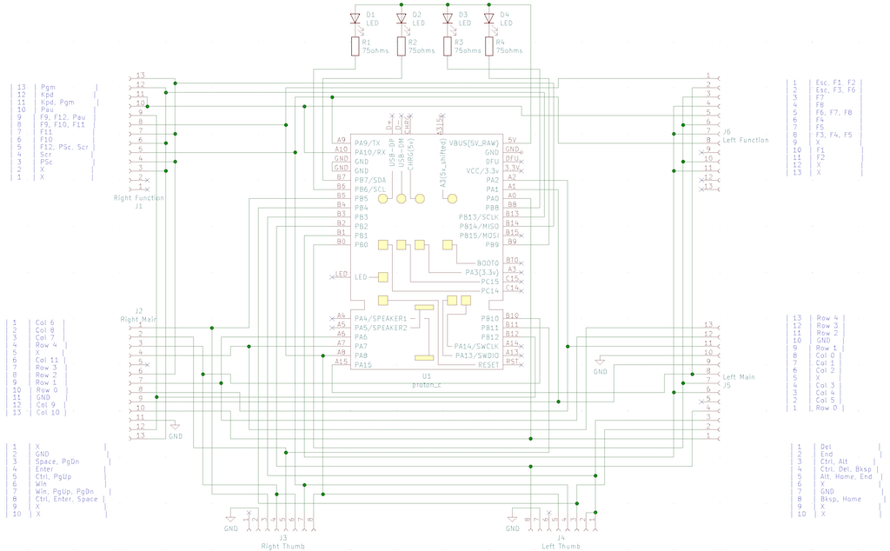

# Wiring matrix

## Matrix

The final matrix is implemented as such:

```
Col      0    1    2    3    4    5    6    7    8    9    10   11
Row Pins A15  B0   B1   B2   B3   B4   B5   B10  B11  B12  B13  B14
0   A0   =    1    2    3    4    5    6    7    8    9    0    -
1   A1   Tab  Q    W    E    R    T    Y    U    I    O    P    \
2   A2   CapL A    S    D    F    G    H    J    K    L    ;    '
3   A6   LSh  Z    X    C    V    B    N    M    ,    .    /    RSh
4   A7        `    \    ←         →    ↑         ↓    [    ]
5   A8   Esc  F1   F2   Home End  LALt Spc  Ent  RCtl F9   F10  F11
6   A9   F3   F4   F5   BSpc Del  LCtl PgDn GUI  PgUp F12  PSc  ScLk
7   A10  F6   F7   F8                                 Paus Kpd  Prgm
```

## LEDs

Using `PWMD4`

| Pin | PWM Channel | LED # | Function    |
|-----|-------------|-------|-------------|
| B6  | Ch1         | LED 1 | Caps Lock   |
| B7  | Ch2         | LED 2 | Num Lock    |
| B8  | Ch3         | LED 3 | Scroll Lock |
| B9  | Ch4         | LED 4 | Keypad      |

## Other pins

* `A13`: `SWDIO`
* `A14`: `SWCLK`

## Individual matrices

There are a total of six separate "boards": top (function) row, main
key wells, and the thumb clusters.

The top row are silicone rubber dome switches (the newer Advantage 2
uses mechanical switches instead) and do not have diodes so may be
subject to ghosting. This is quite unlikely as you will need to
simultaneously press three or more of those switches to get a ghost.

The other switches are all mechanical Cherry Browns. Each has a
through-hole diode hidden in them with the pins coming out of the
bottom of the switch as would if you had installed an LED for the
switch. The diode's polarity is "row-to-column".

For the main key wells, the matrix layout is largely orthogonal, with
clear rows and columns. In our matrix, we connect both sides of each
row to form a single contiguous row.

The thumb clusters and function rows have weird matrices that use far
more pins than necessary. Fortunately, we are able to pack this down
to three rows and the same 12 columns used by the main key wells.



What follows are the pinouts for each matrix.

### Top left

| Pin | Keys        |
|-----|-------------|
| 1   | Esc, F1, F2 |
| 2   | Esc, F3, F6 |
| 3   | F7          |
| 4   | F8          |
| 5   | F6, F7, F8  |
| 6   | F4          |
| 7   | F5          |
| 8   | F3, F4, F5  |
| 9   | X           |
| 10  | F1          |
| 11  | F2          |
| 12  | X           |
| 13  | X           |

### Top right

| Pin | Keys          |
|-----|---------------|
| 13  | Pgm           |
| 12  | Kpd           |
| 11  | Kpd, Pgm      |
| 10  | Pau           |
| 9   | F9, F12, Pau  |
| 8   | F9, F10, F11  |
| 7   | F11           |
| 6   | F10           |
| 5   | F12, PSc, Scr |
| 4   | Scr           |
| 3   | PSc           |
| 2   | X             |
| 1   | X             |

### Middle left

Columns are left to right, rows are top to bottom.

| Pin | Keys  |
|-----|-------|
| 13  | Row 4 |
| 12  | Row 3 |
| 11  | Row 2 |
| 10  | GND   |
| 9   | Row 1 |
| 8   | Col 0 |
| 7   | Col 1 |
| 6   | Col 2 |
| 5   | X     |
| 4   | Col 3 |
| 3   | Col 4 |
| 2   | Col 5 |
| 1   | Row 0 |

### Middle right

Columns are left to right, rows are top to bottom.

| Pin | Keys   |
|-----|--------|
| 1   | Col 6  |
| 2   | Col 8  |
| 3   | Col 7  |
| 4   | Row 4  |
| 5   | X      |
| 6   | Col 11 |
| 7   | Row 3  |
| 8   | Row 2  |
| 9   | Row 1  |
| 10  | Row 0  |
| 11  | GND    |
| 12  | Col 9  |
| 13  | Col 10 |

### Bottom left

| Pin | Keys            |
|-----|-----------------|
| 1   | Del             |
| 2   | End             |
| 3   | Ctrl, Alt       |
| 4   | Ctrl, Del, Bksp |
| 5   | Alt, Home, End  |
| 6   | X               |
| 7   | GND             |
| 8   | Bksp, Home      |
| 9   | X               |
| 10  | X               |

### Bottom right

| Pin | Keys               |
|-----|--------------------|
| 1   | X                  |
| 2   | GND                |
| 3   | Space, PgDn        |
| 4   | Enter              |
| 5   | Ctrl, PgUp         |
| 6   | Win                |
| 7   | Win, PgUp, PgDn    |
| 8   | Ctrl, Enter, Space |
| 9   | X                  |
| 10  | X                  |

